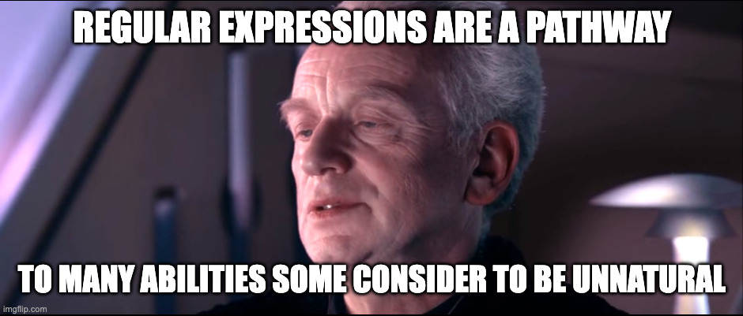
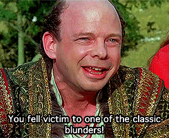

<!-- .slide: class="title-slide" data-hide-footer -->
# Demystifying Regular Expressions

Steve Grunwell <!-- .element: class="byline" -->
[@stevegrunwell@phpc.social](https://phpc.social/@stevegrunwell)
[stevegrunwell.com/slides/regex](https://stevegrunwell.com/slides/regex)

---

## What are regular expressions?



Note:

Regular expressions, at their core, are patterns describing a certain amount of text. We use them for searching, filtering, validation, and so much more.

----

### RegEx or RegExp?


Note:

Let's get this out of the way right out of the gate:

It's the hottest debate since "gif v jif": how do we abbreviate and pronounce regular expressions? With the "p" or without? Rej-ex or reg-ex?

The real answer: nobody cares. I'm going to use "regex" throughout, but know that they all mean the same thing.

----

### A brief history of RegEx

* <!-- .element: class="fragment" --> <strong>1951:</strong> Stephen Cole Kleene and "regular events"
* <!-- .element: class="fragment" --> <strong>1968:</strong> Two main uses
    1. Pattern matching in a text editor
    2. Lexical analysis in a compiler
* <!-- .element: class="fragment" --> <strong>1980s:</strong> Perl <3s RegEx
* <!-- .element: class="fragment" --> <strong>1997:</strong> Enter PCRE

Note:

Far from exhaustive, but a quick history lesson:

* The concept dates back to 1951, when mathematician Stephen Cole Kleene described "regular languages" via his "regular events" mathematical notation
* By 1968, there were two main uses across Unix ecosystem
    * First implemented in QED, then later ed; this lead to grep ("Global search for Regular Expression and Print matching lines", or "Global Regular Expression Print")
* In the 80s, Perl began introducing more powerful features
* Beginning 1997, Philip Hazel developed Perl-Compatible Regular Expressions (PCRE), a flavor that has been adopted by many modern programming languages

----

### Pick your flavor

Two <u>major</u> flavors of regular expressions:

1. <!-- .element: class="fragment" --> Perl-Compatible Regular Expressions ("PCRE")
    * Used in most server-side languages, this talk
2. <!-- .element: class="fragment" --> ECMAScript (JavaScript)

Note:

There are technically dozens of flavors of regular expressions, but generally speaking you'll be working with one of these two

The core concepts are the same, but the implementations are slightly different. We don't get to that level in this talk, but it's something to be aware of.

Examples in this talk will be based around PCRE.

----

### Who needs Regular Expressions?

* <!-- .element: class="fragment" --> Filtering data
* <!-- .element: class="fragment" --> Data validation
* <!-- .element: class="fragment" --> Scraping content
* <!-- .element: class="fragment" --> <a href="https://www.pcworld.com/article/3104748/claude-code-is-scanning-your-messages-for-curse-words.html">Claude's sentiment analysis, apparently</a>

Note:

There are a bunch of places where regular expressions are invaluable:

* Obviously, filtering data and searching for strings. This could be searching in your IDE, filtering lines with grep, etc.
* Validating data: if you need to ensure that usernames are between 4 and 32 characters, containing only alphanumeric characters, regex's got your back!
* If you've built a web scraper before, you've likely need to rely on regular expressions to match patterns in content
* In the Claude source code leak, it was revealed that it uses regular expressions to match phrases like "wtf", "screw this", and "dumbass" to figure out when it needs to act apologetic

---

## Basic concepts

----

### Understanding the format

<code class="regex-format"><span class="format-delimiter fragment" data-fragment-index="1">/</span><span class="format-pattern fragment" data-fragment-index="2">[A-Z0-9]</span><span class="format-delimiter fragment" data-fragment-index="1">/</span><span class="format-flags fragment" data-fragment-index="3">ig</span></code>

1. <!-- .element: class="fragment" data-fragment-index="1"--> Delimiter (commonly <code>/</code>)
2. <!-- .element: class="fragment" data-fragment-index="2" -->Pattern
3. <!-- .element: class="fragment" data-fragment-index="3" -->Flags

Note:

When we look at a regular expression, there are three components we're concerned with:

1. The delimiter, which marks the beginning and end of the pattern. This is usually a forward slash, but it can be anything.
2. The actual pattern we want to match (in this case, any alphanumeric character)
3. Any flags to adjust behavior

We'll go further into all of these.

----

### Literal matches

<regex-demo pattern="/guitar/">How much is that <mark>guitar</mark> in the window?</regex-demo>

Note:

The simplest use of regular expressions is a literal string match: does this string contain the word "wood"?

In these cases, better off using native language functions like `str_contains()`

----

### The engine returns the leftmost match

<regex-demo pattern="/wood/">How much <mark>wood</mark> would a woodchuck chuck if a woodchuck could chuck wood?</regex-demo>
<regex-demo pattern="/wood/g" class="fragment">How much <mark>wood</mark> would a <mark>wood</mark>chuck chuck if a <mark>wood</mark>chuck could chuck <mark>wood</mark>?</regex-demo>


Note:

It's important to understand that by default, regular expressions are designed to find a match and move on; unless you say "give me all of the matches", it'll stop at the leftmost match.

We'll talk more about the global search ("g") flag later, but for now just think of it as "match all occurrences of this pattern in the string".

----

### Character classes

<table>
    <thead>
        <tr>
            <th>Class</th>
            <th>Positive</th>
            <th>Negative</th>
        </tr>
    </thead>
    <tbody>
        <tr>
            <th scope="row">Digit</th>
            <td><code>\d</code></td>
            <td><code>\D</code></td>
        </tr>
        <tr>
            <th scope="row">Word</th>
            <td><code>\w</code></td>
            <td><code>\W</code></td>
        </tr>
        <tr>
            <th scope="row">Whitespace</th>
            <td><code>\s</code></td>
            <td><code>\S</code></td>
        </tr>
    </tbody>
</table>

Note:

There are a number of built-in character classes, which are represented by an escape backslash and either a lowercase or uppercase letter.

The lowercase version matches in the affirmative, while the uppercase is in the negative, so lowercase "D" matches a digit while uppercase "D" matches anything that _isn't_ a digit.

Note that there are a couple more (specifically around Unicode classes) that we won't be getting into here.

----

#### <u>D</u>igit (`\d`)

Matches any digit, 0–9.

<regex-demo pattern="/\d/g">I <<mark>3</mark> PHP <mark>8</mark>.<mark>5</mark>!</regex-demo>
<regex-demo pattern="/\D/g" class="fragment"><mark>I <</mark>3<mark> PHP </mark>8<mark>.</mark>5<mark>!</mark></regex-demo>

Note:

The digit character class is probably the easiest, it's literally any digit from 0–9.

----

#### <u>W</u>ord (`\w`)

Alphanumeric characters and underscores.

<regex-demo pattern="/\w/g"><mark>steve_grunwell_123</mark>@<mark>example</mark>.<mark>com</mark></regex-demo>
<regex-demo pattern="/\W/g" class="fragment">steve_grunwell_123<mark>@</mark>example<mark>.</mark>com</regex-demo>

Note:

The word character class matches alphanumeric characters and underscores.

Be forewarned that it only matches lower ASCII characters, so accented letters don't get matched!

----

#### White<u>s</u>pace (`\s`)

Whitespace, including tabs, newlines, etc.

<regex-demo pattern="/\s/g">Gentlemen,<mark> </mark>this<mark> </mark>is<mark> </mark>democracy<mark> </mark>manifest!</regex-demo>

----

### Character sets

Match specific characters:

<regex-demo pattern="/[Alt]/g"><mark>A</mark> <mark>l</mark>ong <mark>t</mark>ime ago in a ga<mark>l</mark>axy far, far away&hellip;</regex>

Note:

If we wrap characters in square brackets, we create a character set; only A, l, and t will be selected.

Notice that it's only the capital A: regex is case-sensitive by default!

----

#### Negating character sets

Match everything *except* those characters:

<regex-demo pattern="/[^Alt]/g">A l<mark>ong </mark>t<mark>ime ago in a ga</mark>l<mark>axy far, far away&hellip;</mark></regex>

Note:

We can add a caret in our set to negate the pattern, so it selects everything *except* those characters.

----

### Character ranges

Match anything in a range of letters or numbers:

<regex-demo pattern="/[A-Z0-2]/g"><mark>I</mark>t's as easy as <mark>ABC</mark>, <mark>12</mark>3!</regex-demo>

Note:

In this example, capture any capital letter (A–Z) and digits between 0 and 2.

These can also be negated in the same way we just saw, with a caret.

----

### The dot character

Match (almost) _any_ character:

<regex-demo pattern="/C*O/g">I got in trouble with the <mark>CEO</mark>, <mark>CFO</mark>, <mark>CTO</mark>, and <mark>CIO</mark> for my comments</regex-demo>

Note:

The dot character matches anything except for newlines and carriage returns.

You'll see these come up a lot once we get into quantifiers.

----

### Escaping

Use a backslash (`\`) to escape special characters:

<regex-demo pattern="/example.com/g"><mark>example.com</mark>, <mark>example2com</mark>munity.com</regex-demo>
<regex-demo pattern="/example\.com/g" class="fragment"><mark>example.com</mark>, example2community.com</regex-demo>

Note:

As we get further into regular expressions, you'll find that there are a number of reserved characters, which we then have to escape if we want to include them in our patterns.

In this case, we didn't escape the dot in the pattern, so while it *can* match a literal dot character, it can also match any other character, too.

Adding a backslash in our pattern tells the engine that we're looking for a literal dot character.

Speaking of special characters...

----

### Quantifiers

<table>
    <thead>
        <tr>
            <th>Symbol</th>
            <th>Meaning</th>
        </tr>
    </thead>
    <tbody>
        <tr>
            <th scope="row"><code>*</code></th>
            <td>Zero or more</td>
        </tr>
        <tr>
            <th scope="row"><code>+</code></th>
            <td>One or more</td>
        </tr>
        <tr>
            <th scope="row"><code>?</code></th>
            <td>Zero or one</td>
        </tr>
        <tr>
            <th scope="row"><code>{x}</code></th>
            <td>Exactly x</td>
        </tr>
        <tr>
            <th scope="row"><code>{x,y}</code></th>
            <td>Between x and y</td>
        </tr>
        <tr>
            <th scope="row"><code>{x,}</code></th>
            <td>x or more</td>
        </tr>
    </tbody>
</table>

Note:

We use quantifiers to tell the engine how many times we're expecting to see a particular pattern (or sub-pattern) match.

We'll go through each of these, but it can be useful to see them all together:

- The first three are the most-broad: zero or more, one or more, and zero or one.
- The latter three give us more control: we expect to see exactly X, between X and Y, or _at least_ X

----

#### Zero, one, or more

Zero or more capital letters at the start:

<regex-demo pattern="/[A-Z]*\w+/g"><mark>Hello</mark>, <mark>world</mark>!</regex-demo>

At least one capital letter at the start: <!-- .element: class="fragment" data-fragment-index="1" -->

<regex-demo pattern="/[A-Z]+\w+/g" class="fragment" data-fragment-index="1"><mark>Hello</mark>, world!</regex-demo>

Note:

Here, we're specifying that we're looking for zero or more capital letters, followed by at least one word character (which could be any letter).

If we change the asterisk after the character range to a plus sign, that tells the engine that we *only* want to match words that start with capital letters.

----

#### Zero or one

Words with begin with zero or one capital letter:

<regex-demo pattern="/[A-Z]?[a-z]+/g"><mark>Ready</mark>, <mark>set</mark>, GO!</regex-demo>

Note:

In this case, we're looking for words that are either entirely lowercase or start with *one* capital letter.

----

#### Specific number

Four letter words:

<regex-demo pattern="/\w{4}/g"><mark>What</mark> is the charge? Eating a <mark>meal</mark>? A succulent Chinese <mark>meal</mark>?</regex-demo>

----

#### Specified range

Words with 2–4 letters:

<regex-demo pattern="/\w{2,4}/g"><mark>What</mark> <mark>is</mark> <mark>the</mark> charge? Eating <mark>a</mark> meal? <mark>A</mark> succulent Chinese <mark>meal</mark>?</regex-demo>

----

#### At least a certain number

Words with at least 5 letters:

<regex-demo pattern="/\w{5,}/g">What is the <mark>charge</mark>? <mark>Eating</mark> a meal? A <mark>succulent</mark> <mark>Chinese</mark> meal?</regex-demo>

Note:

In this example, we're finding any words with at least five characters.

----

### Anchors

<table>
    <thead>
        <tr>
            <th>Symbol</th>
            <th>Meaning</th>
        </tr>
    </thead>
    <tbody>
        <tr>
            <th scope="row"><code>^</code></th>
            <td>Beginning of string</td>
        </tr>
        <tr>
            <th scope="row"><code>$</code></th>
            <td>End of string</td>
        </tr>
        <tr>
            <th scope="row"><code>\b</code></th>
            <td>Word boundary</td>
        </tr>
        <tr>
            <th scope="row"><code>\B</code></th>
            <td><u>Not</u> word boundary</td>
        </tr>
    </tbody>
</table>

Note:

Like with quantifiers, we have anchors to help modify our patterns.

The first two are certainly the most common: a caret to indicate the beginning of a string, and a dollar sign to indicate the end

You're less likely to see the word boundary anchors, but we'll talk about them as well.

----

#### Start of string (`^`)

<regex-demo pattern="/[A-Z].+/">3. <mark>Profit!</mark></regex-demo>
<regex-demo pattern="/^[A-Z].+/" class="fragment">3. Profit!</regex-demo>

Note:

If we start our pattern with a caret, that means "start evaluating this from the start of a string"—if there's extra whitespace, other characters, etc. then our pattern won't match.

Be aware that this is the *second* use of the caret we've seen: don't confuse this for negating a character set!

----

#### End of string (`$`)

<regex-demo pattern="/over/g">I'm <mark>over</mark> ending messages in "<mark>over</mark>", <mark>over</mark></regex-demo>
<regex-demo pattern="/over$/g" class="fragment">I'm over ending messages in "over", <mark>over</mark></regex-demo>

Note:

Similarly, the dollar sign represents the end of a string.

In this case, adding the dollar sign ensures we only match the last "over" (but if we added punctuation to the sentence, the pattern would cease to match)

Keep in mind that this is matching the entire input string, which is not necessarily a single line. We'll talk about this more when we get to flags in a moment.

----

#### Word boundaries

<regex-demo pattern="/\bart/g">Start making <mark>art</mark> from the heart</regex-demo>
<regex-demo pattern="/\Bart/g">St<mark>art</mark> making art from the he<mark>art</mark></regex-demo>

Note:

The would boundary anchors are related to the `\w` character class we discussed earlier; we can use this to say "only match this pattern if it starts and/or ends with a word boundary"

We can also use it to say "only match if the word *doesn't* start or finish with a word boundary"

----

### Flags

<table>
    <thead>
        <tr>
            <th>Flag</th>
            <th>Meaning</th>
        </tr>
    </thead>
    <tbody>
        <tr>
            <th scope="row"><code>i</code></th>
            <td>Ignore case</td>
        </tr>
        <tr>
            <th scope="row"><code>m</code></th>
            <td>Multi-line</td>
        </tr>
        <tr>
            <th scope="row"><code>s</code></th>
            <td>Dot matches all characters</td>
        </tr>
        <tr>
            <th scope="row"><code>g</code></th>
            <td>Global search</td>
        </tr>
    </tbody>
</table>

Note:

This list isn't exhaustive, but these are the four flags you're most likely to run into.

----

#### Case-insensitive (`i`)

<regex-demo pattern="/fine/">tHiS iS fInE</regex-demo>
<regex-demo pattern="/fine/i" class="fragment">tHiS iS <mark>fInE</mark></regex-demo>

Note:

The case-insensitive ("i") flag is probably the most common one you'll see.

----

#### Mutli-line (`m`)

<regex-demo pattern="/^\*.+/"><mark>* Buy groceries</mark><br>* Pick up prescriptions</regex-demo>
<regex-demo pattern="/^\*.+/m" class="fragment"><mark>* Buy groceries</mark><br><mark>* Pick up prescriptions</mark></regex-demo>

Note:

The multi-line ("m") flag changes the way the caret and dollar-sign anchors work: instead of the beginning/end of the entire string, it treats the anchors as the beginning or end (respectively) of a _line_

In this case, each line that starts with an asterisk gets matched.

Also, note that we had to escape the asterisk: otherwise it would match zero or more start-of-line positions, which could be a subtle bug!

----

#### Dot-all (`s`)

<regex-demo pattern="/world.+fine/">It's the end of the world as we know it,<br> and I feel fine</regex-demo>
<regex-demo pattern="/world.+fine/s" class="fragment">It's the end of the <mark>world as we know it,<br> and I feel fine</mark></regex-demo>

Note:

As you may recall, the dot character normally matches everything _except_ newline and carriage returns. The dot-all ("s") flag changes this behavior so it matches _anything_.

----

#### Global search (`g`)

<regex-demo pattern="/duck/">Let's play <mark>duck</mark>, duck, goose!</regex-demo>
<regex-demo pattern="/duck/g" class="fragment">Let's play <mark>duck</mark>, <mark>duck</mark>, goose!</regex-demo>

Note:

As I mentioned earlier, the global search ("g") flag basically says "match all occurrences of this pattern"; without it, only the first match will be found.

Be aware that functions built into languages will often have different functions designed to return multiple matches (e.g. `preg_match()` and `preg_match_all()` in PHP, `String.match()` and `String.matchAll()` in JavaScript)

----

### Capture groups

<regex-demo pattern="/(\w+) has joined/g"><mark>Ben</mark> has joined<br><mark>Alena</mark> has joined</regex-demo>

Note:

Capture groups let us specify portions of a string that we wish to extract. In this case, we're matching any word followed by "has joined".

So not only do we want to match "$name has joined", but also capture the $name portion as part of a capture group. We do this by wrapping the group in parentheses.

----

#### Capture groups in PHP

```php
$activity = 'Ben has joined. Alena has joined.';
preg_match_all('/(\w+) has joined/', $activity, $matches);
print_r($matches);
```

```php[|2-6|8-12]
Array(
    [0] => Array
        (
            [0] => Ben has joined
            [1] => Alena has joined
        )

    [1] => Array
        (
            [0] => Ben
            [1] => Alena
        )
)
```
<!-- .element: class="fragment hide-line-numbers" -->

Note:

If we take that pattern and use it with PHP's `preg_match_all()` function, we populate a `$matches` array that looks like this:

1. The first array is all of the matched strings (e.g. "Ben has joined")
2. The second array (key of 1) represents the first capture group (e.g. "Ben", "Alena")

If we had multiple capture groups, we'd see additional arrays for capture groups 2, 3, etc.

----

#### Replacing with capture groups

```php[|4]
$activity = 'Ben has joined. Alena has joined.';
echo preg_replace(
    '/(\w+) has joined/',
    '\1 is cool',
    $activity
);
```
<!-- .element: class="hide-line-numbers" -->

```text
Ben is cool. Alena is cool.
```
<!-- .element: class="fragment" -->

Note:

Thanks to capture groups, we can also reference these values when we do replacements.

In this case, we use a backslash and number 1 to reference the value of the first matching group.

----

### Non-capturing groups

<regex-demo pattern="(\w+) plays (?:basket|foot)ball/g"><mark>LeBron plays basketball</mark>. <mark>Travis plays football</mark>. Sammy plays baseball.</regex-demo>

Note:

Parentheses can also be used to group conditions in what is referred to as a "non-capturing group". We indicate this with `?:` after the opening paren.

In this case, we're matching a name and a sport, which starts with either "basket" or "foot" and ends in "ball". However, if we inspect our matches, we won't see a matching group with values "basket" and "foot".

---

## Advanced topics

Note:

We've covered a lot of the basics so far, but regular expressions go so much deeper.

I'll briefly touch on a few advanced topics, but going much deeper will be an exercise for the viewer.

----

### Looking ahead

Positive lookahead (`?=`):
<regex-demo pattern="/\d+(?=\w+)/g">0 <mark>15</mark>px <mark>2</mark>em</regex-demo>

Negative lookahead (`?!`):
<regex-demo pattern="/\d+(?!\w+)/g"><mark>0</mark> 15px 2em</regex-demo>

Note:

Regular Expressions' lookaround capabilities allow you to examine the areas before or after your match.

Lookahead will look after the match and may discard the match if the lookahead expectations are not met.

----

### Looking behind

Positive lookbehind (`?<=`):
<regex-demo pattern="/(?<=\$)\d+/g">He paid $<mark>24</mark> for 3 coffees</regex-demo>

Negative lookbehind (`?<!`):
<regex-demo pattern="/(?<=\$)\d+/g">He paid $2<mark>4</mark> for <mark>3</mark> coffees</regex-demo>

Note:

Lookbehinds are very similar, but we put a less-than (`<`) sign after the question marks.

----

### Lazy v Greedy

Greedy (default):
<regex-demo pattern="/ba(na)+/"><mark>bananananana</mark></regex-demo>

Lazy:
<regex-demo pattern="/ba(na)+?/"><mark>bana</mark>nananana</regex-demo>

Note:

By default, regular expression quantifiers will match as many instances as it can.

If we add a question mark after the quantifier, this tells the engine to be lazy ("ungreedy"); in this case, stop matching after the first group of "na" in "bananananana".

---

## Common patterns

Note:

Now that we have a good understanding of what regular expressions are capable of, let's look at some practical applications:

----

### Grepping logs

```sh
tail -f access.log | grep -Eio '[a-z0-9-]+bot\/[0-9\.]+'
```

```text
Amzn-SearchBot/0.1
SemrushBot/7
Claude-SearchBot/1.0
Googlebot/2.1
ClaudeBot/1.0
bingbot/2.0
DuckAssistBot/1.2
```
<!-- .element: class="fragment" -->

Note:

A common place where we'll use regular expressions are to search through logs.

In this example, we're looking for any combination of letters, numbers, and dashes that end in "bot", followed by a forward slash and something that looks like a version number.

The `-E` tells grep that we're using extended regular expressions, the `-i` is making the search case-insensitive (grep doesn't use flags in the same way), and `-o` filters the result to only the matched substring

We can use this to get a sense of which bots are hitting our server.

----

### Validating user input

```php
$pattern = '/[a-z][a-z0-9_]{1,31}/i';

if (!preg_match($pattern, $username)) {
    throw new ValidationException('Username is invalid!');
}
```

Note:

If you don't have a more-sophisticated library for validating user input, you might do something like this to validate a username.

In this case, we're matching a string that's between 2 and 32 characters that starts with a letter and contains only letters, numbers, and underscores.

If the provided username doesn't match, we'll throw a ValidationException.

----

### Sanitize page slugs

<pre class="progressive-reveal hljs php language-php"><code>$title = "10 Things They Don't Want You to Know!";</code><code class="fragment" data-fragment-index="0">
// Replace whitespace with hyphens
$title = str_replace(' ', '-', strtolower($title));</code><code class="fragment" data-fragment-index="1">
// Alphanumeric or GTFO
$title = preg_replace('/[^a-z0-9-]/i', '', $title);</code></pre>

<pre><code class="hljs plaintext fragment fade-out" data-fragment-index="0">10 Things They Don't Want You to Know!</code><code class="hljs plaintext fragment fade-in-out" data-fragment-index="0">10-things-they-don't-want-you-to-know!</code><code class="hljs plaintext fragment" data-fragment-index="1">10-things-they-dont-want-you-to-know</code></pre>

Note:

Here's a simple replacement I've written a dozen times: taking a string and creating a URL-friendly version.

First, we'll convert any spaces to hyphens; this is a simple match, so we can use a simple `str_replace()`

Next, we'll replace anything *except* for alphanumeric characters and hyphens with an empty string. This leaves us with a pretty slug, free of punctuation or other special characters.

---

## Using RegEx effectively

Note:

Now that you have a good understanding of how regular expressions work and what you can do with them, let's wrap up by talking about how to use them effectively.

----

### Just because you _can_&hellip;


Note:

Regular expressions are extremely powerful, but sometimes it's easy to forget that they're but one tool in our toolbox. If you find yourself reaching for regular expressions for things like parsing markup it's worth pausing and seeing if there are better tools for the job.

----

#### Validating an email?

```php
// Some incomplete regex for an email address
$pattern = '[a-z0-9-_]@[a-z09-](\.[a-z]{2,})+';

if (!preg_match($pattern, $email)) {
    throw new ValidationException('Invalid email!');
}
```
<!-- .element: class="fragment shrink" data-fragment-index="0" -->

 <!-- .element: class="fragment fade-up" data-fragment-index="0" style="margin: 0;" -->

Note:

One of the first places where people hear about regular expressions are for validating things like email addresses, URLs, etc.

Unfortunately, most examples are incomplete and catch only the most typical patterns.

However, if you're working with PHP, there are better ways!

----

#### PHP's filter_var() function

```php[1-3|5-7|9-11]
if (!filter_var($email, FILTER_VALIDATE_EMAIL)) {
    throw new ValidationException('Invalid email!');
}

if (!filter_var($url, FILTER_VALIDATE_URL)) {
    throw new ValidationException('Invalid URL!');
}

if (!filter_var($ip, FILTER_VALIDATE_IP)) {
    throw new ValidationException('Invalid IP address!');
}
```
<!-- .element: class="hide-line-numbers" -->

Note:

PHP's `filter_var()` function has a bunch of built-in patterns for validating things like email addresses, URLs, domains, IP addresses, MAC addresses, and more.

Before you go trying to write a regular expression, check to see what's already available.

----

### Alternative delimiters

<pre class="fragment-replacement"><code class="hljs php language-php fragment fade-out" data-fragment-index="0">$pattern = '/https?:\/\/\w+\.\w{2,}\/?/i';</code><code class="hljs php language-php fragment fade-in" data-fragment-index="0">$pattern = '@https?://\w+\.\w{2,}/?@i';</code></pre>

Common: `@`, `#`, `~`, `%`
<!-- .element: class="fragment" data-fragment-index="1" -->

Note:

Earlier, I mentioned that we can technically use almost any character as a delimiter. The most common character is the forward slash, but that can get messy when dealing with things like filepaths, as you have to escape the delimiter character within a pattern.

Common alternatives include the "at-sign", octothorpe (pound-sign), tilde, and percent sign.

----

### Comment your patterns!

Not everyone's a RegExpert like you 😉

```php
/*
 * Match domain names containing at least 5 characters
 * with TLDs .com, .org, or .net (case-insensitive).
 */
$pattern = '/\w{5,}\.(com|org|net)/i';
```

Note:

While there are ways to add comments within regex patterns, it's just as easy to put a comment before any regular expression.

Eric Mann dinged me on a code review for this in like 2015, and I've been documenting them ever since.

----

### Escaping input strings

<pre class="fragment-replacement overflow-hidden"><code class="hljs php language-php fragment fade-out" data-fragment-index="0">$bands = ['N*SYNC', 'AC/DC', 'Portugal. The Man'];
$pattern = sprintf(
    '/Artist: (%s)/i',
    implode('|', $bands)
);</code><code class="hljs php language-php fragment fade-in" data-fragment-index="0">$bands = ['N*SYNC', 'AC/DC', 'Portugal. The Man'];
$bands = array_map(fn ($b) => preg_quote($b, '/'), $bands);
$pattern = sprintf(
    '/Artist: (%s)/i',
    implode('|', $bands)
);</code></pre>

<pre class="fragment-replace hljs plaintext"><code class="fragment fade-out" data-fragment-index="0">/Artist: (N*SYNC|AC/DC|Portugal. The Man)/i</code><code class="fragment fade-in" data-fragment-index="0">/Artist: (N\*SYNC|AC\/DC|Portugal\. The Man)/i</code></pre>

Note:

If you're dynamically constructing regular expressions, be aware of where the input is coming from.

In PHP, we have the `preg_quote()` function, which escapes characters that are part of the regular expression syntax. Without it, bands like these would break our artist search.

---

## RegEx isn't magic

> Any sufficiently advanced technology is indistinguishable from magic. <cite>Arthur C. Clarke</cite>

Note:

Hopefully this talk has been enlightening for you, but remember that regular expressions are not magic. Just like anything else related to computers, they can be learned and harnessed to do amazing (or heinous things).

British sci-fi author Arthur C. Clarke

----

### Leveling up your skills

* [regexr.com](https://regexr.com/)
* [regex101.com](https://regex101.com/)
* Regex Golf: [alf.nu](https://alf.nu)

Note:

If you'd like to explore regular expressions more, I strongly recommend these sites (also linked to from the slides' README file) for interactively exploring regex patterns

---

## Thank you!

Steve Grunwell<br>
<span style="font-size: .75em;">Staff Software Engineer, Mailchimp</span>

[stevegrunwell.com/slides/regex](https://stevegrunwell.com/slides/regex)<!-- .element: class="slides-link" -->

Note:

REMEMBER TO REPEAT THE QUESTION!!
